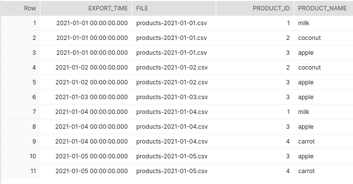
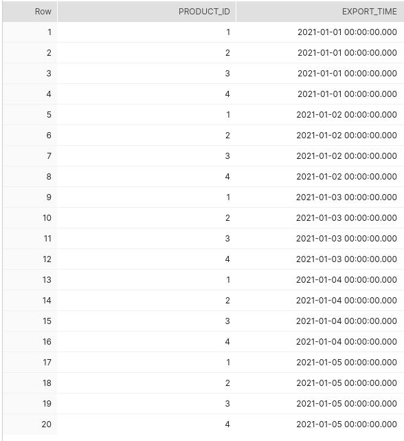
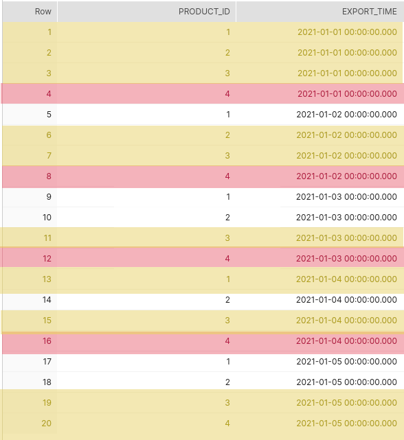
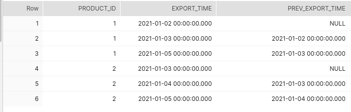
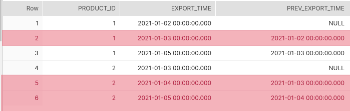
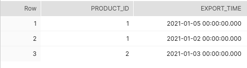
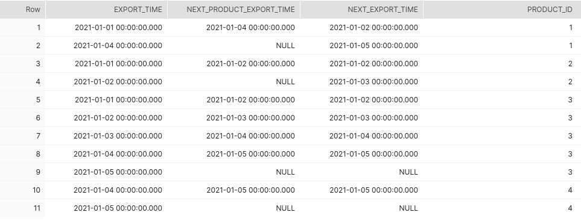
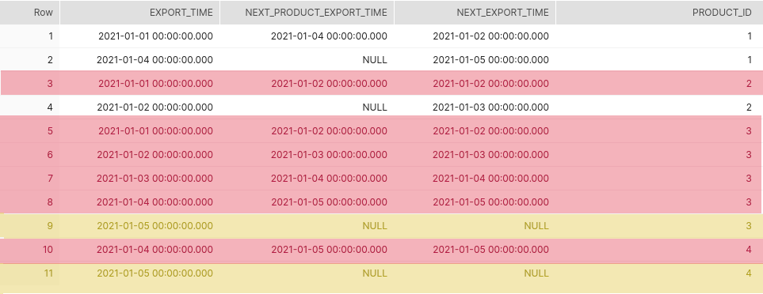

# Infer deletions within batched staging entries

This project presents a possible solution for inferring deletions within the batched staging 
data within an ELT pipeline.

Suppose that a shop is exporting daily towards the data warehouse environment the
whole list of its active products in csv files:

- `products-2021-01-01.csv`
- `products-2021-01-02.csv`
- `products-2021-01-03.csv`
- `products-2021-01-04.csv`
- `products-2021-01-05.csv`
- ...

Obviously from a day to the next there may be new products which get activated or existing
products which get deactivated.

If for a certain period of time, there is no product data ingested in the data warehouse,
it may happen that the product data corresponding to several days in a row may need to be 
staged in the data warehouse.

Let's suppose that some of the products are very short-lived (e.g. : they are active only for a day on the shop).

For the sake of making the problem more complicated, let's assume that these products appear and dissappear
in a sequence of several days  in  a row.

e.g. : the product `milk` is available on `2021-01-01` , but not available anymore on `2021-01-02`, then
again available on `2021-01-04` and not available anymore again starting from `2021-01-05`.


This proof of concept project offers a solution on how to infer deletions of entities in the staging data.

In the scenario described above, for the product milk, there should be created artificially deletion
entries for the dates:
- `2021-01-02`
- `2021-01-05`

On the basis of the insertions & deletions for the products a data engineer can accurately 
find out the availability date ranges for each of the products from the shop.

On the example of the _milk_ product suggested above, the availability intervals would be:

- `2021-01-01` - `2021-01-02`
- `2021-01-04` - `2021-01-05`

The technical solution for the problem described above 
is implemented via [dbt - data build tool](https://docs.getdbt.com).

## Solution description

For the sake of an easier reading of what this project actually does, here will be presented 
visually, step by step how the deletions of the products from the staged data is being inferred.

If the `raw_products` staging table has the following representation:




The starting point is to build a cartesian product between the staging dates and the staged product ids:

```sql
SELECT product_id,
       export_time
FROM (
        (SELECT DISTINCT product_id
        FROM playground.dbt_shop.raw_products)
        CROSS JOIN
        (SELECT DISTINCT export_time
        FROM playground.dbt_shop.raw_products) AS staged_date
);
```



From the cartesian product the following <product id, export_time> entries are chopped off:
- the ones that happen before  the first appearance of a staged entry for a product (marked in red)
- the ones that are found within the staging entries (marked in yellow)


```sql
SELECT product_id,
       export_time
FROM (
          SELECT product_id,
                 export_time
          FROM (
                  (SELECT DISTINCT product_id
                  FROM playground.dbt_shop.raw_products)
                  CROSS JOIN
                  (SELECT DISTINCT export_time
                  FROM playground.dbt_shop.raw_products) AS staged_date
          )
) staged_product_date
WHERE staged_product_date.export_time > (
                                             SELECT MIN(export_time)
                                             FROM playground.dbt_shop.raw_products
                                             WHERE product_id = staged_product_date.product_id
                                         )
  AND staged_product_date.export_time
        NOT IN (
                    SELECT DISTINCT export_time
                    FROM playground.dbt_shop.raw_products
                    WHERE product_id = staged_product_date.product_id
               );
```



The result of this filtering is represented by all the <product, export_time> entries that are not found 
within the staging entries:



Now some of these entries are not necessary. If a product is deleted after the first staging day and
does not occur anymore subsequently, the entry with the minimum export_time is enough information.

What might happen though is that a product is deleted on one day, and appears again on a later day
and is subsequently deleted again.

In order to cope with such a situation, the [LAG](https://docs.snowflake.com/en/sql-reference/functions/lag.html)
window function is being used in order to identify greater gaps between the deletions :

```sql
SELECT product_id,
       export_time
FROM (
        SELECT product_id,
               export_time,
               LAG(export_time) OVER (PARTITION BY product_id ORDER BY export_time) prev_export_time
        FROM (
                  SELECT product_id,
                         export_time
                  FROM (
                          (SELECT DISTINCT product_id
                          FROM playground.dbt_shop.raw_products)
                          CROSS JOIN
                          (SELECT DISTINCT export_time
                          FROM playground.dbt_shop.raw_products) AS staged_date
                  )
        ) staged_product_date

        WHERE staged_product_date.export_time > (
                                                     SELECT MIN(export_time)
                                                     FROM playground.dbt_shop.raw_products
                                                     WHERE product_id = staged_product_date.product_id
                                                 )
          AND staged_product_date.export_time
                NOT IN (
                            SELECT DISTINCT export_time
                            FROM playground.dbt_shop.raw_products
                            WHERE product_id = staged_product_date.product_id
                       )
) AS missing_staged_product
WHERE (
        (missing_staged_product.prev_export_time IS NULL)
        OR missing_staged_product.export_time != (
                                                        SELECT MIN(export_time)
                                                        FROM playground.dbt_shop.raw_products
                                                        WHERE export_time > missing_staged_product.prev_export_time
                                                  )
);
```

The filtering can be observed (marked in red) in the following image:




The operation applied previously corresponds now to the inferred batched product deletions:




## Simplified solution description

Instead of filtering out from the cartesian product of productId and export_time 
to infer the deleted products, there could be used a much simpler solution.

It is assumed again that the `raw_products` staging table has the following representation:


The result of the query

```sql
SELECT
      export_time,
      LEAD(export_time) OVER
          (PARTITION BY product_id ORDER BY export_time)                   AS next_product_export_time,
      (
          SELECT MIN(export_time)
          FROM playground.dbt_shop.raw_products
          WHERE export_time > src.export_time
      )                                                                     AS next_export_time,
      product_id
FROM playground.dbt_shop.raw_products AS src;
```

can be used to see when the next occurrences of product exports happen in the staging data:




There can be now easily be seen that the `next_product_export_time` for some of the entries
is greater that the `next_export_time` or that the  `next_product_export_time` in some cases
is simply `NULL`, otherwise said, is missing.

By applying the query 

```sql
SELECT
    next_export_time               AS export_time,
    product_id,
    (
        next_export_time IS NOT NULL
        AND (next_product_export_time IS NULL OR next_product_export_time > next_export_time)
    )                              AS _deleted
FROM (
        SELECT
            export_time,
            LEAD(export_time) OVER
                (PARTITION BY product_id ORDER BY export_time)                   AS next_product_export_time,
            (
                SELECT MIN(export_time)
                FROM  playground.dbt_shop.raw_products
                WHERE export_time > src.export_time
            )                                                                     AS next_export_time,
            product_id
            FROM  playground.dbt_shop.raw_products AS src
)
WHERE _deleted
```

the valid entries:

- the `next_product_export_time` corresponding to the `next_export_time` (marked in red)
- the entries where the `next_export_time` is `NULL` (marked in yellow) meaning that
these are the product exports done on the last staging day

are being filtered out:



and the result is inferred from the `product_id` and `next_export_time` ) fields:


This second solution is definitely easier to grasp and also probably more efficient.

## Getting started with dbt

As described in the [introduction to dbt](https://docs.getdbt.com/docs/introduction) :

> dbt (data build tool) enables analytics engineers to transform data in their warehouses by simply writing select statements. 
> dbt handles turning these select statements into tables and views.
  
> dbt does the T in ELT (Extract, Load, Transform) processes – it doesn't extract or load data, 
> but it’s extremely good at transforming data that’s already loaded into your warehouse.

---
For more information on dbt:

* Read the [introduction to dbt](https://docs.getdbt.com/docs/introduction).
* Read the [dbt viewpoint](https://docs.getdbt.com/docs/about/viewpoint).
---

## Demo

Use [virtualenv](https://pypi.org/project/virtualenv/) for creating a `virtual` python environment:

```bash
pip3 install virtualenv
virtualenv venv
source venv/bin/activate
```

Once virtualenv is set, proceed to install the requirements for the project:

```bash
(venv) ➜ pip3 install -r requirements.txt
```

Place in `~/.dbt/profiles.yml` file the following content for interacting via dbt with [Snowflake](https://www.snowflake.com/) database:
**NOTE** be sure to change the coordinates of the database according to your Snowflake account. 

```
# For more information on how to configure this file, please see:
# https://docs.getdbt.com/docs/profile
dbt_shop:
  target: dev
  outputs:
    dev:
      type: snowflake
      account: your-account.your-snowflake-region
      port: 443
      user: "your-username"
      password: "your-password"
      role: accountadmin
      threads: 4
      database: playground
      warehouse: analysis_wh_xs
      schema: dbt_shop
config:
  send_anonymous_usage_stats: False
```


Create via the Snowflake query browser the `dbt_shop` schema:

```sql
USE ROLE accountadmin;
CREATE SCHEMA playground.dbt_shop;


CREATE TRANSIENT TABLE IF NOT EXISTS playground.dbt_shop.raw_products
(
    export_time     TIMESTAMP,
    product_id      NUMBER,
    product_name    VARCHAR,
    file            VARCHAR,
);
```

The staging schema for the products is overly simplified for allowing the reader to
concentrate on the essential details of the `dbt` transformation showcased in this project.


If everything is setup correctly, dbt can be used to seed the data needed to try out this project:

```bash
(venv) ➜ dbt seed  --profile dbt_shop
```

```sql
select *
from playground.dbt_shop.raw_products;
```

and subsequently to create the `dbt` model showcased in this project:

```bash
(venv) ➜ dbt run  --profile dbt_shop
```

```sql

select *
from playground.dbt_shop.stg_products
order by product_id, export_time;
```

```

Deactivate the Python virtual environment

```bash
(venv) ➜ deactivate
```

### Ensuring accuracy of the implementation via dtspec 

It takes a while to develop custom logic within `dbt`  and afterwards it is necessary to test it either manually or by doing automated tests to make sure that it works.

By means of using automated tests for data transformations there could be ensured that the model works
as expected with an extensive battery of tests on a test environment.

[dtspec](https://github.com/inside-track/dtspec) is an open-source framework written in Python which can be used 
for specifying and testing data transformations.

Within `dtspec` is specified in a [yaml](https://en.wikipedia.org/wiki/YAML) format:

- the source data in the table(s) to be used by the data transformation(`dbt`) 
- the expected data from the target table(s).

`dtspec` framework offers means to read the yaml specification, and match the data from the actual tables, once
the data transformation has been performed (via `dbt`) with the data from the specification scenario.  


To give a hint to the reader about how `dtspec` works, a test scenario is presented in the lines below.

```yml
        factory:
          data:
            - source: raw_products
              table: |
                | export_time               | file                      | product_id        | product_name         |
                | -                         | -                         | -                 |                      |
                | 2021-01-01 00:00:00+00:00 | products-2021-01-01.csv   | milk              | Milk                 |
                | 2021-01-01 00:00:00+00:00 | products-2021-01-01.csv   | apple             | Apple                |
                | 2021-01-02 00:00:00+00:00 | products-2021-01-02.csv   | apple             | Apple                |
                | 2021-01-03 00:00:00+00:00 | products-2021-01-03.csv   | apple             | Apple                |
                | 2021-01-03 00:00:00+00:00 | products-2021-01-03.csv   | coconut           | Coconut              |

        expected:
          data:
            - target: stg_products
              table: |
                | export_time  | file                      | product_id        | product_name         | _deleted   |
                | -            | -                         | -                 | -                    | -          |
                | 2021-01-01   | products-2021-01-01.csv   | milk              | Milk                 | False      |
                | 2021-01-01   | products-2021-01-01.csv   | apple             | Apple                | False      |
                | 2021-01-02   | products-2021-01-02.csv   | milk              | {NULL}               | True       |
                | 2021-01-02   | products-2021-01-02.csv   | apple             | Apple                | False      |
                | 2021-01-03   | products-2021-01-03.csv   | apple             | Apple                | False      |
                | 2021-01-03   | products-2021-01-03.csv   | coconut           | Coconut              | False      |
              by:
                - export_time
                - product_id
```

This project has introduced minor changes to the test code present in the project 
[jaffle_shop-dtspec](https://github.com/gnilrets/jaffle_shop-dtspec/tree/dtspec)
in order to allow it to run against [Snowflake](https://www.snowflake.com/) database.

In order to run the tests simply execute:

```bash
(venv) ➜  python tests/test.py
```

Below is presented a snippet of the output used for running the tests:

```
(venv) ➜  python3 tests/test.py
Executing test specification tests/demo-spec.yml
Truncating data from the tables ['raw_products', 'stg_products']
Inserting input data into the source table raw_products
/home/marius/findinpath/dbt_infer_staging_deletions/tests/..
Running with dbt=0.19.0
Found 1 model, 5 tests, 0 snapshots, 0 analyses, 143 macros, 0 operations, 0 seed files, 1 source, 0 exposures

13:18:07 | Concurrency: 4 threads (target='dev')
13:18:07 | 
13:18:07 | 1 of 1 START table model dbt_shop.stg_products....................... [RUN]
13:18:09 | 1 of 1 OK created table model dbt_shop.stg_products.................. [SUCCESS 1 in 2.38s]
13:18:11 | 
13:18:11 | Finished running 1 table model in 7.23s.

Completed successfully

Done. PASS=1 WARN=0 ERROR=0 SKIP=0 TOTAL=1
Loading data from the target table stg_products
Loading actuals for target stg_products
Asserting Building stg_products out of the raw_products: Basic full refresh loading of the historized staging table `stg_products`
Tested scenarios: - milk : this product is present on `2021-01-01`, but is then missing until `2021-01-02`.
         This is why on the day `2021-01-02` there should be created artificially
         a deletion for this product.
- apple : this product is present on all the staged days.
          This is why no deletions should be present in the `stg_product` table for this product.


```

**NOTE**: Make sure to follow before the steps described in the _Demo_ section of this document.

To give to the reader a hint about what happens when dtspec finds a mismatch when verifying the content of the 
target table against what is present in the specification, there is presented also a snippet of the output of a failing test:

```
DataFrame are different

DataFrame shape mismatch
[left]:  (5, 5)
[right]: (4, 5)
Actual:
  export_time                     file product_id product_name _deleted
0  2021-01-01  products-2021-01-01.csv      apple        Apple    False
1  2021-01-01  products-2021-01-01.csv       milk         Milk    False
2  2021-01-02  products-2021-01-02.csv      apple        Apple    False
3  2021-01-02  products-2021-01-02.csv       milk       {NULL}     True
4  2021-01-03  products-2021-01-03.csv      apple        Apple    False
Expected:
  export_time                     file product_id product_name _deleted
0  2021-01-01  products-2021-01-01.csv      apple        Apple    False
1  2021-01-01  products-2021-01-01.csv       milk         Milk    False
2  2021-01-02  products-2021-01-02.csv      apple        Apple    False
3  2021-01-03  products-2021-01-03.csv      apple        Apple    False
```


When running the tests for this project, there can be noticed that it takes quite some time to execute them.This happens
in part because Snowflake takes roughly a bit under a second to run any kind of query, even if the query is performed on
an empty database.

Nevertheless, having automated tests for the `dbt` models, even though they are slow, is much better than doing the 
tests by hand or not doing them at all and leaving production as a playground for the developed models.  

---
For more information on dtspec:

* Visit the [dtspec](https://github.com/inside-track/dtspec) Github project page
* Visit the [jaffle_shop-dtspec](https://github.com/gnilrets/jaffle_shop-dtspec/tree/dtspec) Github project to get an
introduction on how to work with `dtspec` & `dbt` for the [jaffle-shop](https://github.com/fishtown-analytics/jaffle_shop)
dbt tutorial project.
---

## Conclusion

This proof of concept project is a possible solution of the rather ELT problem of needing to infer the deletions
for the entries from the batched staging data.

Feel free to provide feedback or alternative implementations to of the topic presented in this project. 
